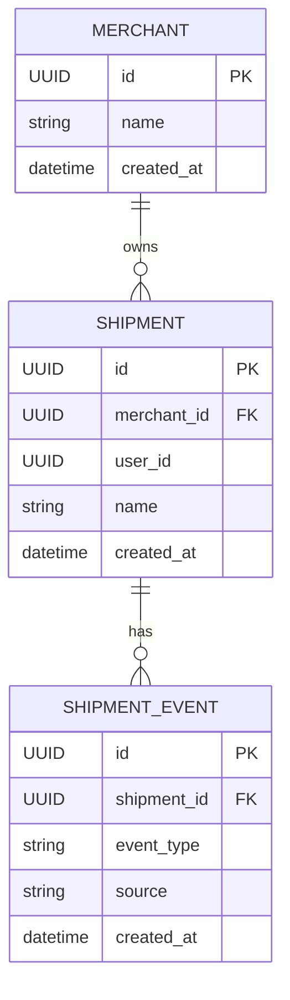

# Python Shipping API

Python Shipping API is a backend service that models a real-world shipment tracking system.  
It provides APIs for managing **merchants**, **shipments**, and **shipment tracking events**, designed with clean domain boundaries and a production-like Docker environment.

The project is built with **FastAPI**, **SQLAlchemy**, and **PostgreSQL**, focusing on correct API design, relational data modeling, and transactional safety.

---

## 1. Overview

This project was built to simulate a real-world shipping platform backend (similar to Sendcloud-style systems), focusing on relational data modeling, transactional safety, and clean API boundaries.

The Shipping API provides:

- A RESTful API for managing merchants and shipments  
- Event-based shipment tracking (created, in-transit, delayed, delivered, etc.)  
- A PostgreSQL-backed relational data model  
- A fully Dockerized local development environment  

This project demonstrates my skills in **backend architecture**, **ORM modeling**, **transaction management**, and **API-first design**.

---

## 2. Tech Stack

### Backend (API)
- Python 3.12
- FastAPI
- SQLAlchemy (ORM)
- Pydantic (schemas & validation)
- PostgreSQL 16

### Infrastructure
- Docker & Docker Compose
- pgAdmin 4 (database inspection & debugging)

---

## 3. Features

### Merchants
- Create merchants
- List merchants
- Retrieve merchant by ID

### Shipments
- Create shipments linked to a merchant
- List shipments
- Retrieve shipment by ID
- Retrieve full shipment details including tracking events

### Shipment Events
- Event-based shipment lifecycle
- Supported event types:
  - `created`
  - `packaged`
  - `in_transit`
  - `picked_up_for_delivery`
  - `delayed`
  - `delivered`
- Event sources:
  - `system`
  - `carrier`
  - `manual`
- Chronologically ordered tracking history per shipment

---

## 4. Domain Model

Core entities:

- **Merchant**
  - Represents a seller or fulfillment entity
- **Shipment**
  - Represents a package belonging to a merchant
- **ShipmentEvent**
  - Represents a state change in a shipment’s lifecycle

Relationships:
- One Merchant → Many Shipments
- One Shipment → Many ShipmentEvents

All relationships are enforced via foreign keys and modeled explicitly in SQLAlchemy.


---

## 5. Project Structure

```text
Python Shipping API/

├── app/
│   ├── core/          # Constants and shared configuration
│   ├── db/            # Database engine, sessions, initialization
│   ├── models/        # SQLAlchemy ORM models
│   ├── schemas/       # Pydantic request/response schemas
│   ├── routers/       # API route definitions
│   ├── dependencies.py
│   └── main.py        # Application entry point
│
├── docker-compose.yml
├── Dockerfile
├── requirements.txt
└── README.md
```

---

## 6. Local Development Setup

- Prerequisites
    - Docker
    - Docker Compose

### Start The Environment

```docker compose up --build```

### Services

Service | Url
--- | ---
FastAPI API | http://localhost:8000
Swagger UI | http://localhost:8000/docs
pgAdmin | http://localhost:5050

---

### Database Access (pgAdmin)
- URL: http://localhost:5050
- Email: admin@admin.com
- Password: admin

### PostgreSQL Connection Details
- Host: db
- Port: 5432
- Database: shipping_db
- User: postgres
- Password: postgres

---

## 7. API Authentication (Development)

For simplicity, endpoints expect an optional header:

```X-Token: fake-super-secret-token```

This simulates authenticated access without implementing a full auth system.

---

## 8. Example Workflow

1. Create a merchant
2. Create a shipment linked to the merchant
3. Automatically create a created shipment event
4. Add additional shipment events (delayed, in-transit, delivered)
5. Retrieve the full shipment timeline via:
```GET /shipments/{id}/full```

---

## 9. Design Decisions

- Separate schemas for create vs response models
Prevents clients from sending or receiving unintended fields
- Event-based shipment tracking
Reflects real-world logistics systems.
- Explicit transactions & rollbacks
Ensures consistency betweem shipments and their events.
- Selective eager loading
Shipment events are loaded only when explicitly requested.
- Atomic shipment + event creation using SQLAlchemy transactions

---

## 10. Roadmap

- This project intentionally focuses on backend corectness over UI or auth complexity

Completed
- Merchant CRUD
- Shipment CRUD
- Shipment event tracking
- Dockerized environment
- PostgreSQL integration

Potential Improvements
- Authentication & authorization
- Pagination & filtering
- Alembic migrations
- Role-based access (admin vs carrier)
- OpenAPI client generation

---

## 11. License

MIT
